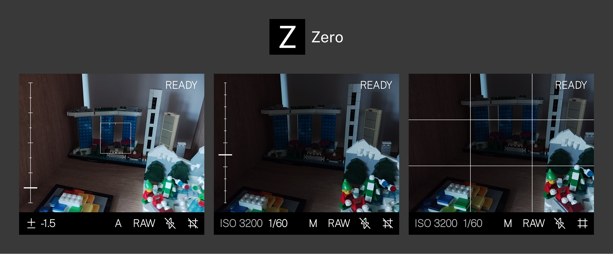

<p>A simple camera app for the Light Phone III.</p>


## Installation

The latest .apk file is available in [releases](https://github.com/vandamd/zero/releases/latest).

I recommend using [Obtainium](https://github.com/ImranR98/Obtainium) and adding the repository's URL to receive updates.

## Features

- Uses the Light Phone III's camera button
- Minimal processing
    - Noise reduction: OFF
    - Edge enhancement: OFF
    - Hot pixel correction: OFF
    - Lens shading correction: FAST
    - Distortion correction: OFF
    - Tonemap: linear identity curve
    - Color correction: FAST (AWB on, aberration OFF)
- Low latency (~160ms from shutter press to exposure) for JPG and RAW
- Zero shutter lag with Hyperfocal mode
- Manual and Auto exposure
- RAW and JPG output
- Composition Grid
- Preview images after capture (long press grid icon to toggle)
- High-res viewfinder (long press flash icon to toggle)
- Optical image stabilisation (long press RGB/BW button to toggle, on by default)
- Red text mode for night photography (long press mode button to toggle). Requires granting permission, outlined in [Greyscale Toggle](#greyscale-toggle).

## Capture Modes

- **JPG** - Standard capture with autofocus and flash
- **HF** - Hyperfocal mode for street photography. Instant shutter with focus locked at 2.2m (sharp from ~1.1m to infinity). No flash.
- **RAW** - Unprocessed DNG files

## Auto Mode Exposure
When exposure compensation is set to a non-zero value, exposure is locked to when it was set. Press the volume up button to re-meter the scene (exposure will briefly reset to 0, meter, then reapply your compensation value).

## Key Mapper

If you use Key Mapper, I recommend setting a trigger to open Zero when the camera button is pressed. Don't forget to add a constraint so it only works when Zero is not in the foreground!

## Greyscale Toggle

Zero can automatically disable greyscale while the app is open and restore it when you leave. 

This requires granting the app special permission via ADB:

```bash
adb shell pm grant com.vandam.zero android.permission.WRITE_SECURE_SETTINGS
```

## Support

Zero is developed and maintained in my free time.

If you find it useful, please [consider sponsoring](https://github.com/sponsors/vandamd)! :)
